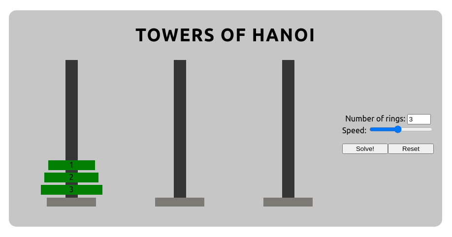

# Towers of Hanoi



## Built with

- [React](https://reactjs.org/)

## Installation

Node.js is required to run this project locally. Node can be downloaded at [nodejs.org](https://nodejs.org/en/).

Clone the repo:

```sh
git clone https://github.com/n-ulricksen/towers-of-hanoi-viz.git
cd towers-of-hanoi-viz
```

Install client & server dependencies:

```sh
npm install
```

## Usage

To run:

```sh
npm start
```

Check out the running application at

```
localhost:3000
```

## Contributing

Pull requests welcome and appreciated!

## License

[MIT](https://choosealicense.com/licenses/mit/)
